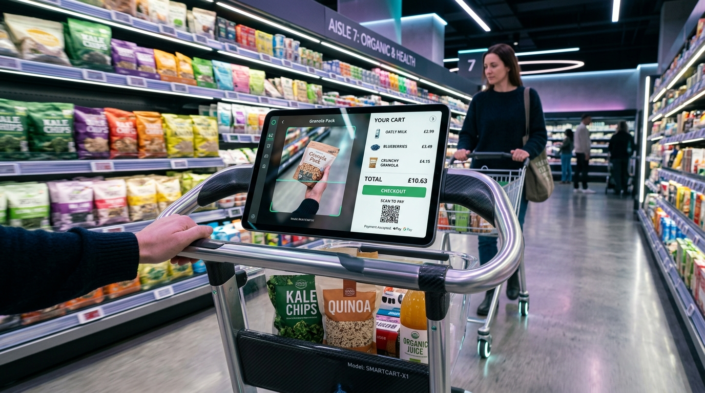
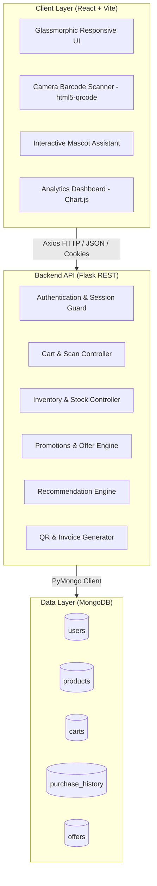

# 🛒 Smart Trolley — Self-Shopping & Automated Billing System (SnapShop)

[](https://react.dev/)
[](https://vitejs.dev/)
[](https://python.org/)
[](https://flask.palletsprojects.com/)
[](https://www.mongodb.com/)
[](https://vercel.com/)
[](LICENSE)

<p align="center">
  
</p>

An intelligent, self-checkout smart trolley and automated supermarket billing solution designed to eliminate long billing queues, enhance the retail shopping experience, and provide store administrators with real-time inventory management.

---

## 📋 Table of Contents

- [Overview](#-overview)
- [Key Features](#-key-features)
- [System Architecture](#-system-architecture)
- [Tech Stack](#-tech-stack)
- [Project Structure](#-project-structure)
- [Getting Started](#-getting-started)
  - [Prerequisites](#prerequisites)
  - [Backend Setup](#backend-setup)
  - [Frontend Setup](#frontend-setup)
  - [Database Seeding](#database-seeding)
- [API Reference](#-api-reference)
- [Environment Configuration](#-environment-configuration)
- [Deployment](#-deployment)
- [Contributing](#-contributing)
- [License](#-license)

---

## 🌟 Overview

Traditional supermarket checkout lines cause customer friction, wasted time, and checkout bottlenecks. **Smart Trolley** turns any shopping cart or personal smartphone into an autonomous checkout terminal.

Shoppers can:
1. **Log in** to their personal account.
2. **Scan items** instantly via device camera or barcode scanner.
3. **Inspect product details**, prices, and personalized recommendations.
4. **Monitor live cart totals**, discounts, and tax computations.
5. **Generate an instant digital invoice & QR payment** for contactless checkout.
6. **Track shopping patterns** and review order history via visual analytics.

Store Managers can:
- Oversee current inventory and stock levels in real time.
- Add, update, or remove products and barcodes.
- Configure promotional discount offers and banners.

---

## ✨ Key Features

### 🛒 Shopper Experience
- **📷 Instant Barcode & QR Scanning**: Integrated web camera scanner powered by `html5-qrcode` with continuous multi-scan and audio cues (`beep`, `scan`, `success`, `welcome`).
- **🧺 Dynamic Cart Management**: Add or remove items, increase/decrease quantities, and view live subtotal and tax computations.
- **🤖 Interactive Mascot Companion**: Interactive assistant providing helpful alerts, promotional updates, and visual cues.
- **🔍 Smart Search & Product Explorer**: Instant search with suggestions, live inventory counters, and category details.
- **💡 Smart Recommendation Engine**: Context-aware product recommendations based on items added to the cart and popular inventory.
- **🧾 Contactless Billing & QR Payments**: Instant invoice generation with dynamic UPI / payment QR codes for fast payment verification.
- **📊 Purchase History & Visual Analytics**: Interactive chart dashboards powered by `chart.js` to view monthly spend trends and transaction history.

### 🛡️ Store Administration
- **📦 Stock & Inventory Control**: Live stock indicators (In Stock, Low Stock, Out of Stock) with quick stock increment/decrement buttons.
- **🏷️ Promotional Offer Management**: Add, modify, or delete discount offers with start/expiry dates and percentage discounts.
- **🔐 Secure Access Control**: Role-based access (Shopper vs. Admin), Werkzeug password hashing, and secure session management.

---

## 🏗️ System Architecture



---

## 🛠️ Tech Stack

### Frontend
- **Framework**: [React 19](https://react.dev/) + [Vite](https://vitejs.dev/)
- **Routing**: [React Router DOM v7](https://reactrouter.com/)
- **Scanner**: [html5-qrcode](https://github.com/mebjas/html5-qrcode)
- **Charts & Data Viz**: [Chart.js](https://www.chartjs.org/) & [react-chartjs-2](https://react-chartjs-2.js.org/)
- **HTTP Client**: [Axios](https://axios-http.com/)
- **Styling**: Vanilla Modern CSS (Glassmorphism, animations, dark mode theme)

### Backend
- **Framework**: [Flask 3.x](https://flask.palletsprojects.com/)
- **CORS Handling**: `Flask-Cors` (configured for cross-origin credentials)
- **Database Driver**: `pymongo` with `dnspython` (MongoDB Atlas ready)
- **Security**: `Werkzeug.security` (secure password hashing)
- **QR Code Generation**: `qrcode[pil]`
- **Audio Feedback**: HTML5 Web Audio & bundled sound effects

### Database & Deployment
- **Database**: MongoDB (Local or MongoDB Atlas cluster)
- **Cloud Hosting**: [Vercel](https://vercel.com/) (configured via `vercel.json` for both frontend and backend)

---

## 📁 Project Structure

```text
trolley/
├── backend/
│   ├── static/               # Product images and static media
│   ├── main.py               # Main Flask REST API application
│   ├── requirements.txt      # Python dependencies
│   ├── vercel.json           # Vercel deployment configuration for Python
│   ├── seed_mongo.py         # MongoDB database initial seeder
│   ├── create_admin.py       # Helper script to create an admin user
│   ├── update_quantities.py  # Utility script for stock synchronization
│   └── *.mp3                 # Audio notification sounds
│
├── frontend/
│   ├── public/               # Public assets, mascot images, trolley icons
│   ├── src/
│   │   ├── assets/           # Sound files and SVG icons
│   │   ├── components/       # Mascot, BackgroundAnimation, ProtectedRoute
│   │   ├── pages/
│   │   │   ├── Login.jsx            # User & Admin authentication
│   │   │   ├── Register.jsx         # New shopper onboarding
│   │   │   ├── Home.jsx             # Welcome portal and navigation
│   │   │   ├── Scanner.jsx          # Barcode scanner and live cart
│   │   │   ├── Search.jsx           # Real-time product search
│   │   │   ├── ProductDetails.jsx   # Nutritional and pricing info
│   │   │   ├── Bill.jsx             # Invoice and dynamic UPI QR code
│   │   │   ├── Dashboard.jsx        # Admin inventory & offers panel
│   │   │   └── History.jsx          # Shopping history and expense charts
│   │   ├── App.jsx           # App routes and lazy loading setup
│   │   ├── index.css         # Design system tokens and styles
│   │   └── main.jsx          # Axios base URL and root mount
│   ├── package.json          # Node dependencies and scripts
│   ├── vite.config.js        # Vite dev server proxy configuration
│   └── vercel.json           # Frontend routing rewrite configuration
│
├── assets/                   # Showcase banners and documentation assets
│   └── smart_trolley_banner.jpg
├── .gitignore                # Ignored build artifacts and environment files
└── README.md                 # Project documentation
```

---

## 🚀 Getting Started

### Prerequisites

Ensure you have the following installed on your system:
- **Node.js**: `v18.0.0` or higher ([Download](https://nodejs.org/))
- **Python**: `v3.9` or higher ([Download](https://www.python.org/))
- **MongoDB**: Local MongoDB community server or a free [MongoDB Atlas](https://www.mongodb.com/atlas) URI

---

### Backend Setup

1. **Navigate to the backend directory**:
   ```bash
   cd backend
   ```

2. **Create and activate a virtual environment**:
   - **Windows (PowerShell)**:
     ```powershell
     python -m venv venv
     .\venv\Scripts\Activate.ps1
     ```
   - **macOS / Linux**:
     ```bash
     python3 -m venv venv
     source venv/bin/activate
     ```

3. **Install dependencies**:
   ```bash
   pip install -r requirements.txt
   ```

4. **Configure Environment Variables** (Optional, creates default local connection if omitted):
   Create a `.env` file in `backend/`:
   ```env
   MONGO_URI=mongodb://localhost:27017/barcodedb
   SECRET_KEY=your_super_secure_secret_key
   PORT=5003
   ```

5. **Start the Flask server**:
   ```bash
   python main.py
   ```
   *The backend will be running at `http://localhost:5003`.*

---

### Database Seeding

To populate the database with initial sample products, barcodes, and images:

```bash
python seed_mongo.py
```

To create an administrator account:
```bash
python create_admin.py
```

---

### Frontend Setup

1. **Navigate to the frontend directory**:
   ```bash
   cd ../frontend
   ```

2. **Install Node packages**:
   ```bash
   npm install
   ```

3. **Start the development server**:
   ```bash
   npm run dev
   ```
   *The frontend will run at `http://localhost:5173` with automatic API proxying to `http://localhost:5003`.*

---

## 📡 API Reference

| Method | Endpoint | Description | Auth Required |
|---|---|---|---|
| `POST` | `/api/register` | Register a new user | No |
| `POST` | `/api/login` | Authenticate shopper or admin | No |
| `POST` | `/api/logout` | Terminate session | Yes |
| `POST` | `/api/scan-item` | Process barcode scan and update cart | Yes |
| `GET` | `/api/get-scanned-items` | Fetch current active cart | Yes |
| `POST` | `/api/remove-item` | Remove or decrement item from cart | Yes |
| `POST` | `/api/save-history` | Archive cart and record checkout | Yes |
| `GET` | `/api/get-history` | Retrieve user checkout history | Yes |
| `GET` | `/api/search` | Search product catalog by name/barcode | Yes |
| `GET` | `/api/recommended` | Get smart product recommendations | Yes |
| `GET` | `/api/stock` | Get full product inventory | Yes |
| `POST` | `/api/product/add` | Add new product to catalog | Admin |
| `POST` | `/api/product/edit` | Edit existing product details | Admin |
| `POST` | `/api/product/update-stock` | Increment/decrement inventory count | Admin |
| `POST` | `/api/product/remove` | Delete a product from inventory | Admin |
| `GET` | `/api/offers` | Fetch active promotional discounts | Yes |
| `POST` | `/api/offer/add` | Create a new promotion offer | Admin |
| `POST` | `/api/offer/edit` | Modify an existing offer | Admin |
| `POST` | `/api/offer/remove` | Remove promotional offer | Admin |

---

## ⚙️ Environment Configuration

### Frontend (`frontend/.env`)
```env
# Optional: Set this when pointing to a deployed backend API
VITE_API_PROXY_TARGET=http://localhost:5003
```

### Backend (`backend/.env`)
```env
MONGO_URI=mongodb+srv://<username>:<password>@cluster0.mongodb.net/barcodedb?retryWrites=true&w=majority
SECRET_KEY=your_custom_jwt_or_session_key
PORT=5003
```

---

## ☁️ Deployment

### Deploying on Vercel

Both `backend` and `frontend` contain pre-configured `vercel.json` files for zero-configuration deployment on [Vercel](https://vercel.com):

1. **Frontend**:
   - Framework preset: `Vite`
   - Root directory: `frontend`
   - Build command: `npm run build`
   - Output directory: `dist`
   - Set environment variable: `VITE_API_PROXY_TARGET=<YOUR_VERCEL_BACKEND_URL>`

2. **Backend**:
   - Root directory: `backend`
   - Runtime: `@vercel/python`
   - Set environment variables: `MONGO_URI` and `SECRET_KEY`

---

## 🤝 Contributing

Contributions, issues, and feature requests are welcome!
1. Fork the Project.
2. Create your Feature Branch (`git checkout -b feature/AmazingFeature`).
3. Commit your Changes (`git commit -m 'Add some AmazingFeature'`).
4. Push to the Branch (`git push origin feature/AmazingFeature`).
5. Open a Pull Request.

---

## 📄 License

This project is licensed under the MIT License — see the [LICENSE](LICENSE) file for details.
